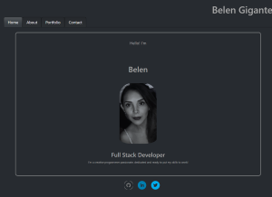

# React Portfolio

## Description

This web site is a portfolio using React to test our new learn skills, also serves a a preparation to what will be our real interactive professional portfolio to be presented to possible employers.
It has a navbar that will allow the viewer to navigate the site in an effortless and self guided way, when the viewer clicks on the about section will find a brief biografy followed by a link to my resume in google documents.
The next tab is Portfolio, it showcases links and images to previous projects, where the viewer can click and access GitHub repositories or deployed websites for front end projects.
Finally, the viewer can leave a message along with an e-mail and name, the email input has validation to ensure the viewer doesnt enter mock e-mails, and the textboxes wont allow empty strings, if the viewer attemps to do any of the above a message will display.
The viewer will be able to access my GitHub, LinkedIn or Twitter accounts from the footer, which is available at all times.(Only Github will direct the viewer to my personal account, LinkedIn and Twitter will show their home pages),

## Visuals

Homepage

About Section

.png)

Portfolio Section

.png)

Contact Section

.png)

## Links

[GitHub](https://github.com/BelenGigante/React-Portfolio.git)

[Deployed URL](https://belengigante.github.io/React-Portfolio/#home)